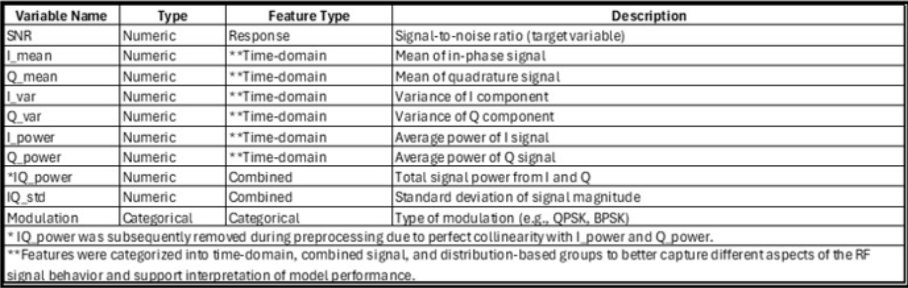
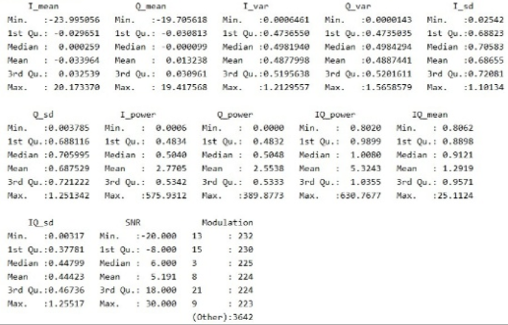
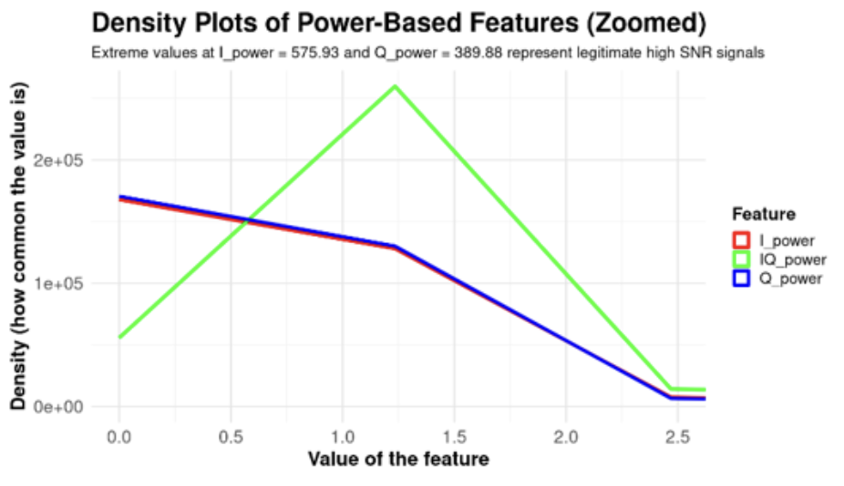

Slides: [slides.html](slides.html){target="_blank"}


## Introduction

{#fig-ew-visual fig-alt="Density plot of power-based features" width=80%}


  The military has been using Electronic Warfare (EW) since World War I
[@noauthor_under_nodate]. With recent technological advances, EW will
continue to evolve; most recently, through the military use of drones,
which depend on reliable radio frequency (RF) links and are vulnerable
to jamming and interference [@vgi_admin_drones_2025]. Recently, machine
learning is used to address these threats. For example, Jere et al.
combined supervised learning with Bayesian network inference to detect
and classify jamming in 5G New Radio networks in near real time
[@10352089]. That work shows that Bayesian methods can utilize machine
learning models in wireless security which will be more accurate and
more interpretable [@10352089]. The selection of a signal dataset that
supports both neural network modeling and Bayesian analysis to predict
signal-to-noise ratio (SNR) and examine how signal quality varies across
conditions [@10352089]. 

  Our project uses the DeepSig RadioML 2018.01A
dataset, downloaded from Kaggle, containing simulated RF signals across
different modulation types with varying levels of noise [@OShea2018].
The dataset includes 24 modulation types, 26 SNR levels ranging from −20
dB to +30 dB, and 1,024 in-phase and quadrature (I/Q) samples per
signal, for approximately 2.5 million total observations [@OShea2018].
It therefore provides a useful schema for studying how signal quality
changes under different interference conditions [@OShea2018]. 

  The objective of this project is to model SNR as the response variable using
neural networks and Bayesian analysis. Bayesian methods treat model
parameters as probability distributions rather than fixed values. This
allows prior knowledge to be formally incorporated and results to be
expressed as direct probability statements about quantities of interest
[@Berger01122000]. Applied to neural networks, the Bayesian framework
has a solution to overfitting and ways to quantify uncertainty in
predictions [@Bishop1997]. In addition, Bayesian neural networks are
better than standard networks when data are noisy, because Bayesian
neural networks reports show how confident each prediction is
[@DBLP:journals/corr/abs-1801-07710]. Guidance on using these models
with deep learning tools is explained by Jospin et al. Because the
dataset is large, scalability is an important consideration [@9756596].
Hernández-Lobato et al. studied that "probabilistic backpropagation
allows Bayesian neural networks to be trained efficiently on large
datasets while retaining accurate uncertainty estimates"
[@pmlr-v37-hernandez-lobatoc15]. 

  Because our dataset DeepSig 2018 contains a large number of raw signal 
measurements, feature engineering techniques will be applied to summarize the I/Q components into meaningful predictors. It might be seen that some of the predictors are correlated with one another, so factor sensitivity analysis using
Bayesian neural networks will identify which inputs strongly influence
the predicted SNR [@5376749]. Model performance will be evaluated using
statistics metrics such as mean squared error (MSE). Comparisons will be
made to assess how well regularization methods commonly used in neural
networks handle multicollinearity and improve prediction accuracy. In
the Bayesian setting, prior distributions on network weights act as a
natural form of regularization, comparable to weight decay in
conventional networks [@Bishop1997]. Finally, Bayesian optimization will
be considered for tuning model hyperparameters. Prior work shows that it
can find strong configurations with fewer training runs than grid or
random search [@snoek2015scalable].

## Methods

- Detail the models or algorithms used.

- Justify your choices based on the problem and data.

*The common non-parametric regression model is*
$Y_i = m(X_i) + \varepsilon_i$*, where* $Y_i$ *can be defined as the sum
of the regression function value* $m(x)$ *for* $X_i$*. Here* $m(x)$ *is
unknown and* $\varepsilon_i$ *some errors. With the help of this
definition, we can create the estimation for local averaging i.e.*
$m(x)$ *can be estimated with the product of* $Y_i$ *average and* $X_i$
*is near to* $x$*. In other words, this means that we are discovering
the line through the data points with the help of surrounding data
points. The estimation formula is printed below [@R-base]:*

$$
M_n(x) = \sum_{i=1}^{n} W_n (X_i) Y_i  \tag{1}
$$$W_n(x)$ *is the sum of weights that belongs to all real numbers.
Weights are positive numbers and small if* $X_i$ *is far from* $x$*.*

*Another equation:*

$$
y_i = \beta_0 + \beta_1 X_1 +\varepsilon_i
$$

## Analysis and Results

### Data Exploration and Visualization

The RadioML 2018.01A dataset, created by DeepSig Inc. and accessed via Kaggle (pinxau1000, 2021) and used for this analysis. The dataset contains 5,000 observations across 13 variables. The response variable, SNR ranges from -20dB to +30dB across 26 discrete levels. Each observation represents a radio signal originally captured as 1,024 I/Q samples, which were summarized into 11 statistical features for analysis. I/Q data describes the behavior of the RF signal. The I_power is defined as In-phase (aligned with the original wave) and Q_power stands for Quadrature (a shift of 90 degrees), so this signal would be out-of-phase from the original wave by 90 degrees.  I/Q together explain the complete structure of the RF signal, Amplitude, Phase and Frequency. (In-phase and quadrature components, 2026) For modulation, a dummy variable was created to handle the modulation type, which has 24 distinct categories. No missing values were identified, and the data was balanced across modulation types with approximately 200 observations per class, shown in Table 1. 

The dataset was prepared by several preprocessing steps for analysis. First, the modulation variable was converted from integer to factor as a categorical variable with 24 distinct modulation types. Multicollinearity testing showed IQ_power was perfectly correlated with Q_power. This correlation was confirmed using the alias() function in R and is consistent with the physical definition of total signal power in RF systems where total power equals the sum of the I and Q channel powers (O'Shea & Hoydis, 2017). Therefore, IQ_power was removed from the dataset to remove the ambiguity of perfect collinearity.

#### Variable Descriptions
{#fig-data_table fig-alt="Description of Dataset" width=80%}

#### Variable General Statistics
{#fig-exploratory_analysis width=80%}

Outlier analysis identified extreme values in power-based features, with I_power reaching 575.93 and Q_power reaching 389.88. A density plot shown in Figure 1 was created to visually examine these extreme values. After careful consideration, the outliers are retained in the dataset since they represent legitimate high SNR signal conditions errors. Removing them would remove signal behavior needed for analysis. All predictor variables were standardized prior to model fitting. Standardization transforms each variable to have a mean of zero and standard deviation of one, which is needed for regularization methods which penalize coefficients based on magnitude. Standardization ensures that all predictors are penalized equally regardless of their original scale.

{#fig-density-power fig-alt="Density plot of power-based features" width=80%}


```{python}
#| label: fig-cor-heatmap
#| fig-cap: "Correlation Heatmap of all Variables"
import pandas as pd
import numpy as np
import matplotlib.pyplot as plt
import seaborn as sns
data = pd.read_csv("radioml_features.csv")

sns.heatmap(data.corr(),cmap="coolwarm",center=0)

```


Histograms are shown to display the distribution of our Signal-to-Noise (SNR) Ratios and Modulation values in our dataset (@fig-snr-dist and @fig-modulation-dist, respectively)


```{python}
#| label: fig-snr-dist
#| fig-cap: "Distribution of Signal-to-Noise Ratio in the RadioML dataset"
import pandas as pd
import numpy as np
import matplotlib.pyplot as plt
data = pd.read_csv("radioml_features.csv")

bins1 = np.arange(min(data['SNR'].to_numpy())-1,max(data["SNR"].to_numpy())+2)


plt.hist(data['SNR'].to_numpy(),bins=bins1,edgecolor='black')
counts = []
for val in list(set(data["SNR"].to_numpy())):
  counts.append(list(data["SNR"].to_numpy()).count(val))
plt.ylabel("Frequency")
plt.xlabel("SNR Ratio")
plt.axhline(np.array(counts).mean(),-30,30,linestyle='--',color='red')
#plt.title("Response Variable (Signal-to-Noise Ratio) Distribution")
plt.show()

```

The SNR distribution has 26 discrete levels from -20dB to +30dB, visually appears to look like a uniform distribution


```{python}
#| label: fig-modulation-dist
#| fig-cap: "Distribution of Modulation Type in the RadioML dataset"
import pandas as pd
import numpy as np
import matplotlib.pyplot as plt
data = pd.read_csv("radioml_features.csv")

bins1 = np.arange(min(data['Modulation'].to_numpy())-1,max(data["Modulation"].to_numpy())+2)


plt.hist(data['Modulation'].to_numpy(),bins=bins1,edgecolor='black')
counts = []
for val in list(set(data["Modulation"].to_numpy())):
  counts.append(list(data["Modulation"].to_numpy()).count(val))
plt.ylabel("Frequency")
plt.xlabel("Modulation")
plt.axhline(np.array(counts).mean(),xmin=-30,xmax=30,linestyle='--',color='red')
#plt.title("Response Variable (Signal-to-Noise Ratio) Distribution")
plt.show()


```

The modulation distribution has 24 modulation types, balanced classes approximately 200 per type, with the lowest count at 189 observations and the highest count at 232, a difference of only 43 observations out of 5000. This small difference confirms the dataset does not have a significant class imbalance.


Scatter plots are shown to display the distribution of our mean and power features within our dataset (@fig-means and @fig-powers, respectively)


```{python}
#| label: fig-means
#| fig-cap: "Comparing Means"
import pandas as pd
import numpy as np
import matplotlib.pyplot as plt
data = pd.read_csv("radioml_features.csv")
for col,c,name in zip(["I_mean","Q_mean","IQ_mean"],['red','blue','green'],["I Mean","Q Mean","IQ Mean"]):
  plt.scatter(data[col].to_numpy(),data['SNR'].to_numpy(),c=c,edgecolors='black',label=name,alpha=0.4, s=15)
#plt.title("Response Variable (Signal-to-Noise Ratio) Distribution")
plt.legend()
plt.ylabel("Signal-to-Noise Ratio")
plt.show()

```

```{python}
#| label: fig-powers
#| fig-cap: "Comparing Powers"
import pandas as pd
import numpy as np
import matplotlib.pyplot as plt
data = pd.read_csv("radioml_features.csv")
for col,c,name in zip(["I_power","Q_power","IQ_power"],['red','blue','green'],["I Power","Q Power","IQ Power"]):
  plt.scatter(data[col].to_numpy(),data['SNR'].to_numpy(),c=c,edgecolors='black',label=name,alpha=0.4, s=15)
plt.legend()
plt.ylabel("Signal-to-Noise Ratio")
plt.show()
#plt.title("Response Variable (Signal-to-Noise Ratio) Distribution")
#plt.legend()
#plt.ylabel("Signal-to-Noise Ratio")
#plt.show()

```


### Modeling and Results

- Explain your data preprocessing and cleaning steps.

- Present your key findings in a clear and concise manner.

- Use visuals to support your claims.

- **Tell a story about what the data reveals.**


### Conclusion

- Summarize your key findings.

- Discuss the implications of your results.

## References